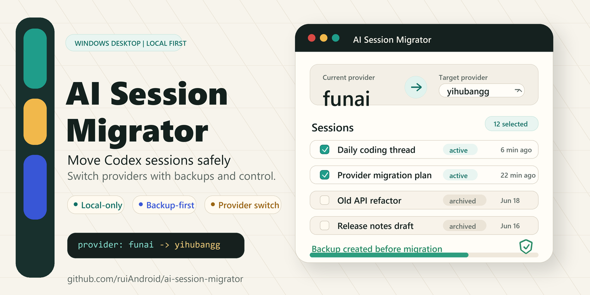

# AI Session Migrator

简体中文 | [English](README.en.md)



**AI Session Migrator** 是一个本地优先的桌面应用，用来把 Codex 会话从一个 AI provider 迁移到另一个 provider。

它可以扫描本机 Codex Desktop 会话，选择来源 provider 和目标 provider，预览变更，自动创建备份，并把选中的会话迁移到新的 provider。整个过程都在本机完成，不上传你的会话数据。

> Windows 桌面应用。基于 Tauri、React、TypeScript 和 Rust 构建。

## 为什么做这个工具

当你切换 AI provider 后，旧会话可能仍然绑定在之前的 `model_provider` 上。这会让后续继续会话、整理会话或修复可见性状态变得麻烦。

AI Session Migrator 提供一个更安全、更直观的桌面流程：

- 扫描活跃会话和已归档会话。
- 查看每个会话当前使用的 provider。
- 选择来源 provider 和目标 provider。
- 写入前先预览变更。
- 迁移或删除前自动创建备份。
- 删除不再需要的已归档会话。

## 功能亮点

- **桌面版优先**：正常使用不需要打开浏览器。
- **本地处理**：无遥测、无云端上传、无远程解析。
- **Provider 迁移**：把选中的会话从旧 provider 迁移到新 provider。
- **目标 provider 下拉选择**：可以选择扫描到的 provider，也可以手动输入自定义 provider。
- **区分活跃和归档会话**：活跃会话优先展示，归档会话会有明确标识。
- **归档清理**：确认并备份后，可以删除选中的已归档会话。
- **写入前备份**：迁移和删除都会先创建备份目录。
- **预览和确认**：真正写入前可以先预览，并通过确认弹窗再次确认。
- **中文界面**：当前桌面界面主要面向中文用户。

## 下载

推荐通过 GitHub Releases 下载：

1. 打开仓库的 **Releases** 页面。
2. 下载 `AI-Session-Migrator-Windows-x64-setup.exe`。
3. 运行应用，点击 **扫描会话**。

应用默认读取当前用户的 `.codex` 目录。你也可以手动指定其他 Codex 数据目录。

> 早期版本还没有代码签名，Windows 可能会显示 SmartScreen 提醒。这是未签名小众工具在初期常见的提示。

## 安全模型

会话文件里可能包含私密提示词、代码、本机路径和业务上下文，所以这个项目默认把会话数据当作敏感数据处理。

安全规则很简单：

1. **不做遥测**
2. **不上传云端**
3. **写入前备份**
4. **破坏性操作前确认**

迁移或删除归档会话前，应用会在选中的 Codex 目录下创建备份目录。

## 截图

首个公开版本发布后会补充截图。

建议补充的截图：

- 主界面扫描结果和 provider 下拉框。
- 迁移预览。
- 迁移完成后的备份操作提示。
- 删除归档会话确认弹窗。

## 本地开发

安装依赖：

```powershell
npm install
```

运行桌面应用：

```powershell
npm run dev
```

仅调试前端：

```powershell
npm run web:dev
```

构建开发验证版桌面 exe：

```powershell
npm run build
```

开发验证版 exe 构建产物位置：

```text
apps/desktop/src-tauri/target/release/ai-session-migrator.exe
```

构建可分发安装包：

```powershell
npm --workspace apps/desktop run desktop:bundle
```

安装包构建可能会在 Windows 上下载 NSIS/WiX 等外部打包工具。对普通用户发布时，请使用安装包产物，不要直接分发 `target/release/ai-session-migrator.exe`。

## 验证

运行前端测试：

```powershell
npm test
```

运行 Rust 核心测试：

```powershell
cd apps/desktop/src-tauri
cargo test --lib
```

运行桌面安装包构建：

```powershell
npm run desktop:bundle
```

在 Windows 上，桌面脚本会尽量自动加载 Visual Studio C++ 编译环境。桌面构建还需要 Windows SDK，因为 Rust/Tauri 需要链接 `kernel32.lib` 等 Windows 系统库。

## 发布自动化

仓库包含 GitHub Actions workflow。推送版本 tag 后会自动构建 Windows exe：

```powershell
git tag v0.1.0
git push origin v0.1.0
```

workflow 会把 `AI-Session-Migrator-Windows-x64-setup.exe` 上传到 GitHub Release。

## 路线图

- 增加英文界面切换。
- 增加签名版 Windows 安装包。
- 增加更强的会话搜索和筛选。
- 增加从备份恢复的可视化流程。
- 随 Codex 存储格式变化扩展 provider 迁移检查。

## 许可证

MIT
